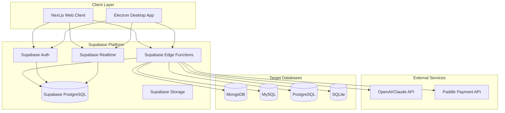

# Design Document

## Overview

The Database GUI Client is a multi-platform application consisting of a Supabase backend for authentication and payment management, a Next.js TypeScript web client for product showcase and account management, and an Electron desktop application built with React, Shadcn UI, and TailwindCSS that provides full database connectivity and management features. The desktop client connects directly to MongoDB, MySQL, PostgreSQL, and SQLite databases, enhanced with AI-powered query assistance and natural language database interactions.

## Architecture

### High-Level Architecture



### Technology Stack

- **Backend**: Supabase (PostgreSQL, Auth, Storage) for authentication and payment management
- **Web Client**: Next.js 14 with TypeScript, React 18, Tailwind CSS (product showcase and account management)
- **Desktop Client**: Electron with React 18, Shadcn UI, TailwindCSS (full database management features)
- **Database Drivers**: mongoose, mysql2, pg, sqlite3 (in Electron main process)
- **Authentication**: Supabase Auth (JWT, OAuth, Magic Links)
- **AI Integration**: OpenAI API, Anthropic Claude API (called from desktop client)
- **Payment**: Paddle API (integrated with Supabase)
- **Application Database**: Supabase PostgreSQL

## Components and Interfaces

### Backend Components (Supabase Only)

#### 1. Authentication Service
```typescript
// Supabase client configuration
interface SupabaseConfig {
  url: string;
  anonKey: string;
  serviceRoleKey: string;
}

// User profile (extends Supabase Auth User)
interface UserProfile {
  id: string; // matches auth.users.id
  email: string;
  subscription_tier: 'free' | 'pro' | 'enterprise';
  ai_usage_count: number;
  ai_usage_reset_date: string;
  created_at: string;
  updated_at: string;
}

// Authentication service for both web and desktop clients
class AuthService {
  async signUp(email: string, password: string): Promise<User>;
  async signIn(email: string, password: string): Promise<Session>;
  async signOut(): Promise<void>;
  async resetPassword(email: string): Promise<void>;
  async getProfile(userId: string): Promise<UserProfile>;
}

// Payment service for subscription management
class PaymentService {
  async createSubscription(userId: string, planId: string): Promise<Subscription>;
  async cancelSubscription(subscriptionId: string): Promise<void>;
  async updatePaymentMethod(userId: string, paymentMethodId: string): Promise<void>;
  async getSubscriptionStatus(userId: string): Promise<SubscriptionStatus>;
}

// Supabase RLS (Row Level Security) policies ensure users only access their own data
```

#### 2. Desktop Client Components (Electron + React)

#### Database Connection Manager (Electron Main Process)
```typescript
interface DatabaseConnection {
  id: string;
  type: 'mongodb' | 'mysql' | 'postgresql' | 'sqlite';
  config: ConnectionConfig;
  status: 'connected' | 'disconnected' | 'error';
}

interface ConnectionConfig {
  host?: string;
  port?: number;
  database: string;
  username?: string;
  password?: string;
  ssl?: boolean;
  filePath?: string; // for SQLite
  connectionString?: string; // for MongoDB/MySQL/SQLite
}

class DatabaseConnectionManager {
  async connect(config: ConnectionConfig): Promise<DatabaseConnection>;
  async disconnect(connectionId: string): Promise<void>;
  async testConnection(config: ConnectionConfig): Promise<boolean>;
  async getSchema(connectionId: string): Promise<DatabaseSchema>;
}
```

#### Query Execution Engine (Electron Main Process)
```typescript
interface QueryRequest {
  connectionId: string;
  query: string;
  parameters?: any[];
  limit?: number;
  offset?: number;
}

interface QueryResult {
  data: any[];
  totalRows: number;
  executionTime: number;
  columns: ColumnInfo[];
  error?: string;
}

class QueryExecutor {
  async executeQuery(request: QueryRequest): Promise<QueryResult>;
  async explainQuery(request: QueryRequest): Promise<QueryExplanation>;
  validateQuery(query: string, dbType: string): ValidationResult;
}
```

#### AI Service Integration (Electron Main Process)
```typescript
interface AIQueryRequest {
  naturalLanguage: string;
  databaseSchema: DatabaseSchema;
  databaseType: string;
  context?: string[];
}

interface AIQueryResponse {
  generatedQuery: string;
  explanation: string;
  confidence: number;
  suggestions?: string[];
}

class AIService {
  async generateQuery(request: AIQueryRequest): Promise<AIQueryResponse>;
  async optimizeQuery(query: string, schema: DatabaseSchema): Promise<string>;
  async chatWithDatabase(message: string, context: ChatContext): Promise<ChatResponse>;
}
```

### Web Client Components (Next.js)

#### 1. Landing Page Component
```typescript
interface LandingPageProps {
  features: ProductFeature[];
  testimonials: Testimonial[];
  pricing: PricingPlan[];
}

// Product showcase with features, benefits, and call-to-action
```

#### 2. Authentication Components
```typescript
interface AuthFormProps {
  mode: 'signin' | 'signup' | 'reset';
  onSubmit: (credentials: AuthCredentials) => void;
  isLoading: boolean;
}

// Login, signup, and password reset forms
```

#### 3. Dashboard Component
```typescript
interface DashboardProps {
  user: UserProfile;
  subscription: SubscriptionStatus;
  downloadLinks: DownloadLink[];
}

// User dashboard with subscription status and download links
```

#### 4. Payment Management Component
```typescript
interface PaymentManagerProps {
  subscription: SubscriptionStatus;
  plans: PricingPlan[];
  onSubscribe: (planId: string) => void;
  onCancel: () => void;
}

// Subscription management and payment processing
```

### Desktop Client Components (Electron + React + Shadcn)

#### 1. Main Application Layout
```typescript
interface MainLayoutProps {
  user?: User;
  onSkipLogin: () => void;
}

// Frameless window with custom title bar, menu, and layout
```

#### 2. Custom Title Bar Component
```typescript
interface CustomTitleBarProps {
  onMenuClick: () => void;
  currentDatabase?: DatabaseConnection;
  databases: DatabaseConnection[];
  onDatabaseSwitch: (dbId: string) => void;
  onSearch: (query: string) => void;
  onChatToggle: () => void;
}

// Custom title bar with menu, DB switcher, search, and chat trigger
```

#### 3. Login/Signup Dialog Component
```typescript
interface AuthDialogProps {
  isOpen: boolean;
  onClose: () => void;
  onSkip: () => void;
  onSuccess: (user: User) => void;
}

// Modal dialog for authentication with skip option
```

#### 4. New DB Connection Dialog
```typescript
interface NewConnectionDialogProps {
  isOpen: boolean;
  onClose: () => void;
  onSave: (config: ConnectionConfig) => void;
  initialType?: 'mongodb' | 'mysql' | 'sqlite';
}

// Dialog for adding new database connections with connection string input
```

#### 5. Database Tree Explorer Component
```typescript
interface DatabaseTreeProps {
  connection: DatabaseConnection;
  schema: DatabaseSchema;
  selectedTable?: string;
  onTableSelect: (tableName: string) => void;
  onRefresh: () => void;
}

// Left sidebar tree view for database structure navigation
```

#### 6. Query Editor Component
```typescript
interface QueryEditorProps {
  query: string;
  databaseType: string;
  onQueryChange: (query: string) => void;
  onExecute: () => void;
  onAIAssist: () => void;
  syntaxHighlighting: boolean;
}

// Right top panel - Code editor with syntax highlighting and AI assistance
```

#### 7. Results Viewer Component
```typescript
interface ResultsViewerProps {
  data: QueryResult;
  viewMode: 'table' | 'tree' | 'json';
  onViewModeChange: (mode: string) => void;
  onExport: (format: string) => void;
}

// Right bottom panel - Multi-format data visualization component
```

#### 8. AI Chat Sidebar Component
```typescript
interface AIChatSidebarProps {
  isOpen: boolean;
  messages: ChatMessage[];
  onSendMessage: (message: string) => void;
  isLoading: boolean;
  databaseContext: DatabaseSchema;
  onClose: () => void;
}

// Right sidebar AI chatbot interface for natural language queries
```

## Data Models

### Supabase Database Schema

```sql
-- User profiles (extends auth.users)
CREATE TABLE public.user_profiles (
  id UUID REFERENCES auth.users(id) ON DELETE CASCADE PRIMARY KEY,
  email VARCHAR(255) NOT NULL,
  subscription_tier VARCHAR(50) DEFAULT 'free',
  ai_usage_count INTEGER DEFAULT 0,
  ai_usage_reset_date TIMESTAMP DEFAULT CURRENT_TIMESTAMP,
  created_at TIMESTAMP DEFAULT CURRENT_TIMESTAMP,
  updated_at TIMESTAMP DEFAULT CURRENT_TIMESTAMP
);

-- Enable RLS
ALTER TABLE public.user_profiles ENABLE ROW LEVEL SECURITY;

-- RLS Policy: Users can only access their own profile
CREATE POLICY "Users can view own profile" ON public.user_profiles
  FOR SELECT USING (auth.uid() = id);

CREATE POLICY "Users can update own profile" ON public.user_profiles
  FOR UPDATE USING (auth.uid() = id);

-- Download tracking
CREATE TABLE public.downloads (
  id UUID PRIMARY KEY DEFAULT gen_random_uuid(),
  user_id UUID REFERENCES auth.users(id) ON DELETE CASCADE,
  platform VARCHAR(50) NOT NULL, -- 'windows' or 'macos'
  version VARCHAR(50) NOT NULL,
  downloaded_at TIMESTAMP DEFAULT CURRENT_TIMESTAMP
);

-- Enable RLS
ALTER TABLE public.downloads ENABLE ROW LEVEL SECURITY;

-- RLS Policy: Users can only access their own downloads
CREATE POLICY "Users can view own downloads" ON public.downloads
  FOR SELECT USING (auth.uid() = user_id);

-- Subscription payments
CREATE TABLE public.payments (
  id UUID PRIMARY KEY DEFAULT gen_random_uuid(),
  user_id UUID REFERENCES auth.users(id) ON DELETE CASCADE,
  paddle_payment_id VARCHAR(255) UNIQUE,
  amount INTEGER NOT NULL,
  currency VARCHAR(3) DEFAULT 'USD',
  status VARCHAR(50) NOT NULL,
  created_at TIMESTAMP DEFAULT CURRENT_TIMESTAMP
);

-- Enable RLS
ALTER TABLE public.payments ENABLE ROW LEVEL SECURITY;

-- RLS Policy: Users can only view their own payments
CREATE POLICY "Users can view own payments" ON public.payments
  FOR SELECT USING (auth.uid() = user_id);

-- Function to create user profile on signup
CREATE OR REPLACE FUNCTION public.handle_new_user()
RETURNS TRIGGER AS $$
BEGIN
  INSERT INTO public.user_profiles (id, email)
  VALUES (NEW.id, NEW.email);
  RETURN NEW;
END;
$$ LANGUAGE plpgsql SECURITY DEFINER;

-- Trigger to create profile on user signup
CREATE TRIGGER on_auth_user_created
  AFTER INSERT ON auth.users
  FOR EACH ROW EXECUTE FUNCTION public.handle_new_user();
```

### Database Schema Representation

```typescript
interface DatabaseSchema {
  databases: Database[];
}

interface Database {
  name: string;
  tables: Table[];
  collections?: Collection[]; // for MongoDB
}

interface Table {
  name: string;
  columns: Column[];
  indexes: Index[];
  foreignKeys: ForeignKey[];
}

interface Column {
  name: string;
  type: string;
  nullable: boolean;
  primaryKey: boolean;
  defaultValue?: any;
}

interface Collection {
  name: string;
  sampleDocument?: any;
  indexes: MongoIndex[];
}
```

## Error Handling

### Error Classification

```typescript
enum ErrorType {
  CONNECTION_ERROR = 'CONNECTION_ERROR',
  QUERY_SYNTAX_ERROR = 'QUERY_SYNTAX_ERROR',
  AUTHENTICATION_ERROR = 'AUTHENTICATION_ERROR',
  AUTHORIZATION_ERROR = 'AUTHORIZATION_ERROR',
  AI_SERVICE_ERROR = 'AI_SERVICE_ERROR',
  PAYMENT_ERROR = 'PAYMENT_ERROR',
  VALIDATION_ERROR = 'VALIDATION_ERROR',
  INTERNAL_SERVER_ERROR = 'INTERNAL_SERVER_ERROR'
}

interface AppError {
  type: ErrorType;
  message: string;
  details?: any;
  code: string;
  timestamp: Date;
}
```

### Error Handling Strategy

1. **Connection Errors**: Retry logic with exponential backoff
2. **Query Errors**: Syntax validation and helpful error messages
3. **AI Service Errors**: Fallback to basic query assistance
4. **Payment Errors**: Clear user communication and retry options
5. **Authentication Errors**: Secure error messages without information leakage

### Global Error Handler

```typescript
class ErrorHandler {
  static handle(error: AppError, context: string): void {
    // Log error
    logger.error(`${context}: ${error.type}`, error);
    
    // Send appropriate response
    switch (error.type) {
      case ErrorType.CONNECTION_ERROR:
        return this.handleConnectionError(error);
      case ErrorType.QUERY_SYNTAX_ERROR:
        return this.handleQueryError(error);
      // ... other error types
    }
  }
}
```

## Testing Strategy

### Backend Testing (Supabase + Edge Functions)

1. **Unit Tests**
   - Edge Function logic
   - Database connection managers
   - Query execution logic
   - AI service integration
   - Payment processing

2. **Integration Tests**
   - Supabase Auth integration
   - Database connectivity across all supported types
   - Edge Function deployment and execution
   - Supabase Realtime functionality
   - External service integration (AI, payments)

3. **End-to-End Tests**
   - Complete user workflows
   - Cross-platform compatibility
   - Supabase RLS policy testing
   - Performance under load

### Frontend Testing

1. **Component Tests**
   - React component rendering
   - Flutter widget testing
   - User interaction handling
   - State management

2. **Integration Tests**
   - API communication
   - Real-time updates
   - Cross-component data flow

3. **Visual Regression Tests**
   - UI consistency across platforms
   - Responsive design validation

### Testing Tools

- **Supabase/Edge Functions**: Deno test, Supabase CLI for local testing
- **Web Frontend**: Jest, React Testing Library, Playwright
- **Electron Desktop**: Jest, React Testing Library, Electron testing utilities
- **Load Testing**: Artillery.js for Edge Function load testing
- **Database Testing**: Supabase local development environment

### Performance Testing

1. **Database Connection Pooling**: Test connection limits and performance
2. **Query Execution**: Benchmark query performance across database types
3. **AI Response Times**: Monitor AI service response times and implement timeouts
4. **Real-time Updates**: Test WebSocket performance with multiple concurrent users
5. **Memory Usage**: Monitor memory consumption, especially for large result sets

### Security Testing

1. **Authentication**: Test JWT token security and expiration
2. **SQL Injection**: Validate query parameterization
3. **Credential Storage**: Test encryption of stored database credentials
4. **API Security**: Test rate limiting and input validation
5. **Cross-Platform Security**: Ensure consistent security across web and desktop clients